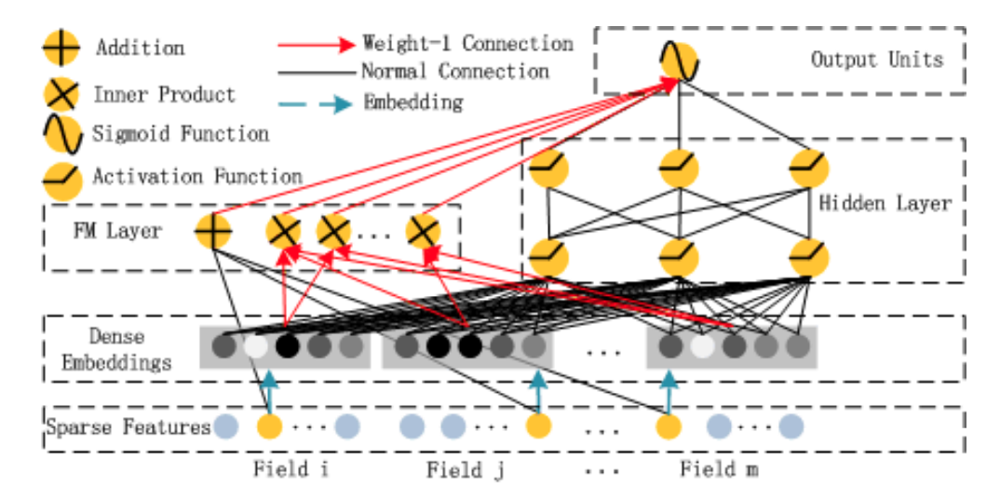
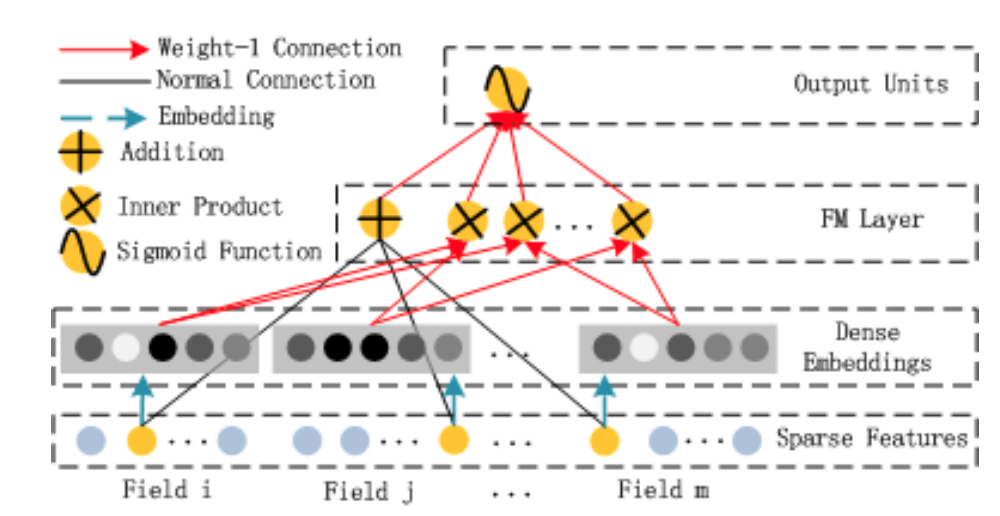
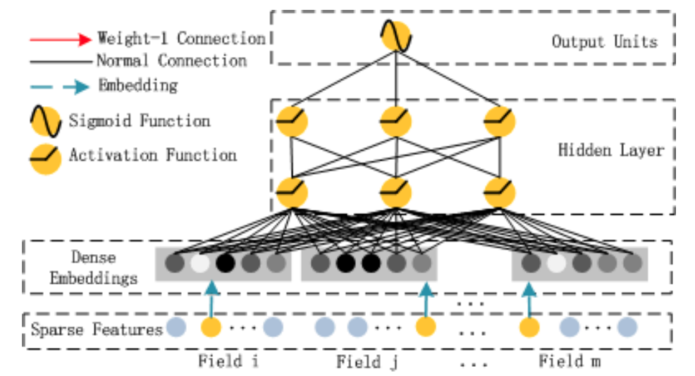

## DeepFM: A Factorization-Machine based Neural Network for CTR Prediction
- [Paper PDF](./DeepFM:%20A%20Factorization-Machine%20based%20Neural%20Network%20for%20CTR%20Prediction.pdf)
- [Slides](https://docs.google.com/presentation/d/1CFIdUMAk2U5n-u-aQOf7N6mv63r7njQD_5M7vEx8up8/edit?usp=sharing)

### DeepFM

- end-to-end learning model that emphasizes both low and high order feature interactions
- combines factorization machines (FM) and deep neural network (DNN)
- Learn implicit feature interactions behind user click behaviors

### FM component
 

### DNN component
 